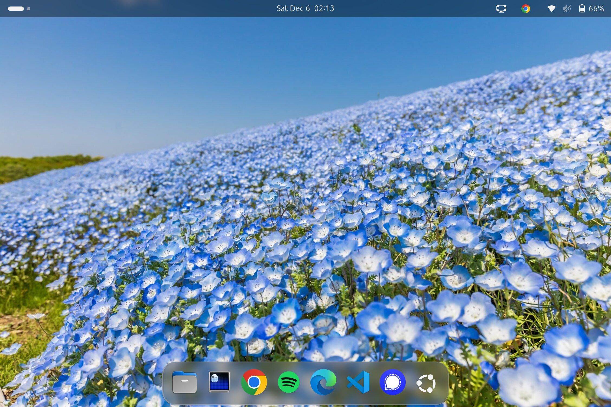
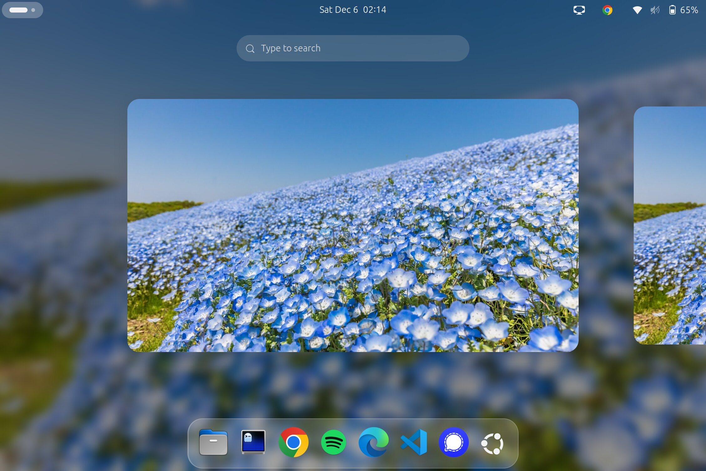
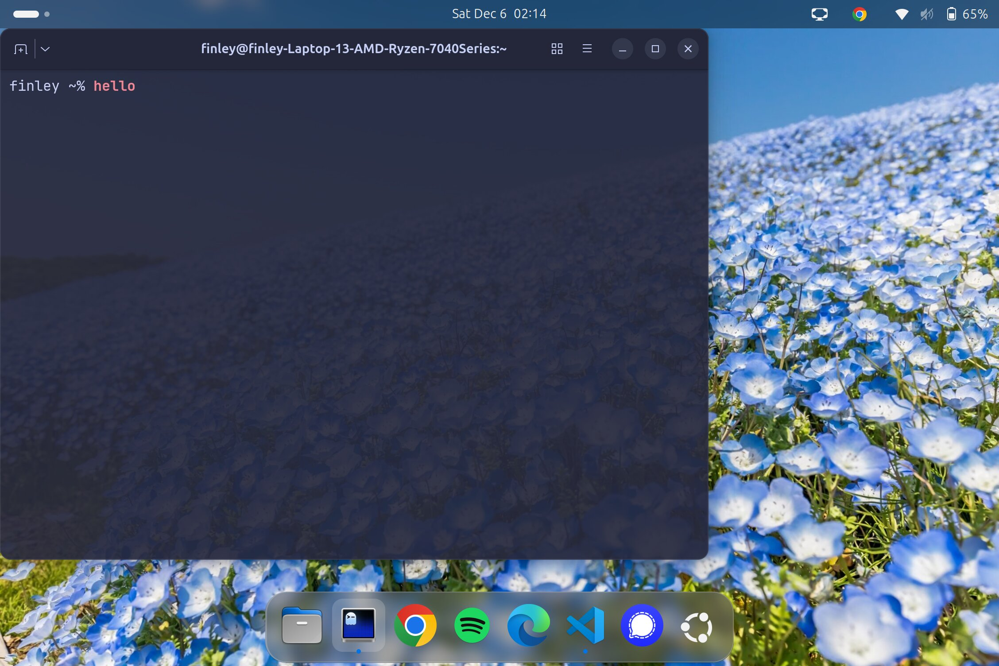

# Ubuntu Setup

Automated setup script for Ubuntu 24.04 with development tools and dotfiles.

## Table of Contents
- [Screenshots](#screenshots)
- [Quick Start](#quick-start)
- [What Gets Installed](#what-gets-installed)

## Screenshots

### Clean Desktop


### Desktop Overview


### Terminal


## Quick Start

### 1. Install Git

```bash
sudo apt update
sudo apt install -y git
```

### 2. Set up SSH keys for GitHub

```bash
# Generate SSH key
ssh-keygen -t ed25519 -C "your.email@example.com"

# Start the ssh-agent
eval "$(ssh-agent -s)"

# Add your SSH key to the agent
ssh-add ~/.ssh/id_ed25519

# Display your public key
cat ~/.ssh/id_ed25519.pub
```

Add the key to GitHub:
1. Go to https://github.com/settings/keys
2. Click "New SSH key"
3. Paste your public key and save

### 3. Clone and run setup

```bash
git clone git@github.com:yourusername/ubuntu-setup.git
cd ubuntu-setup
chmod +x setup-ubuntu.sh
./setup-ubuntu.sh
```

### 4. Post-installation

After the script completes:

1. Log out and log back in for shell changes to take effect
2. Configure Git credentials:
   ```bash
   git config --global user.name "Your Name"
   git config --global user.email "your.email@example.com"
   ```

## What Gets Installed

- Zsh with Oh My Zsh and plugins
- JetBrainsMono Nerd Font
- Ghostty terminal
- Neovim with plugins
- VS Code with extensions
- GNOME extensions (Blur My Shell, Dash to Dock)
- Micromamba for Python environments
- Docker
- LaTeX
- Google Chrome, Edge, Discord, Spotify, Signal, Obsidian
- Additional utilities (tmux, fzf, btop, etc.)